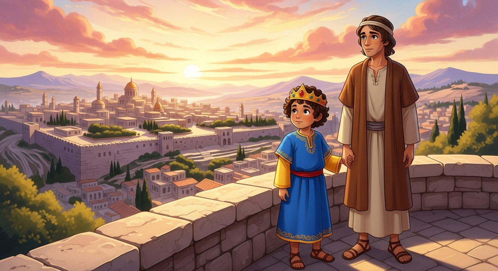
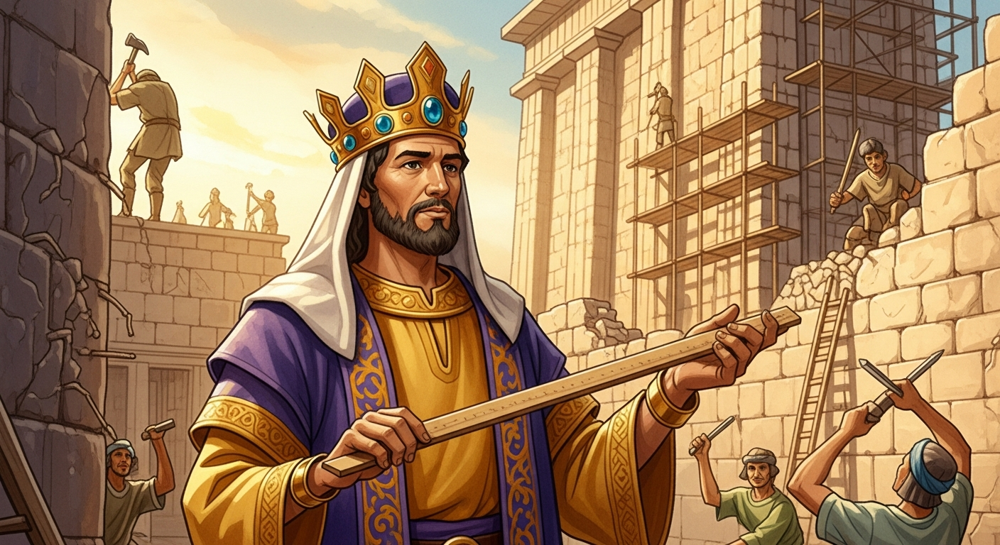
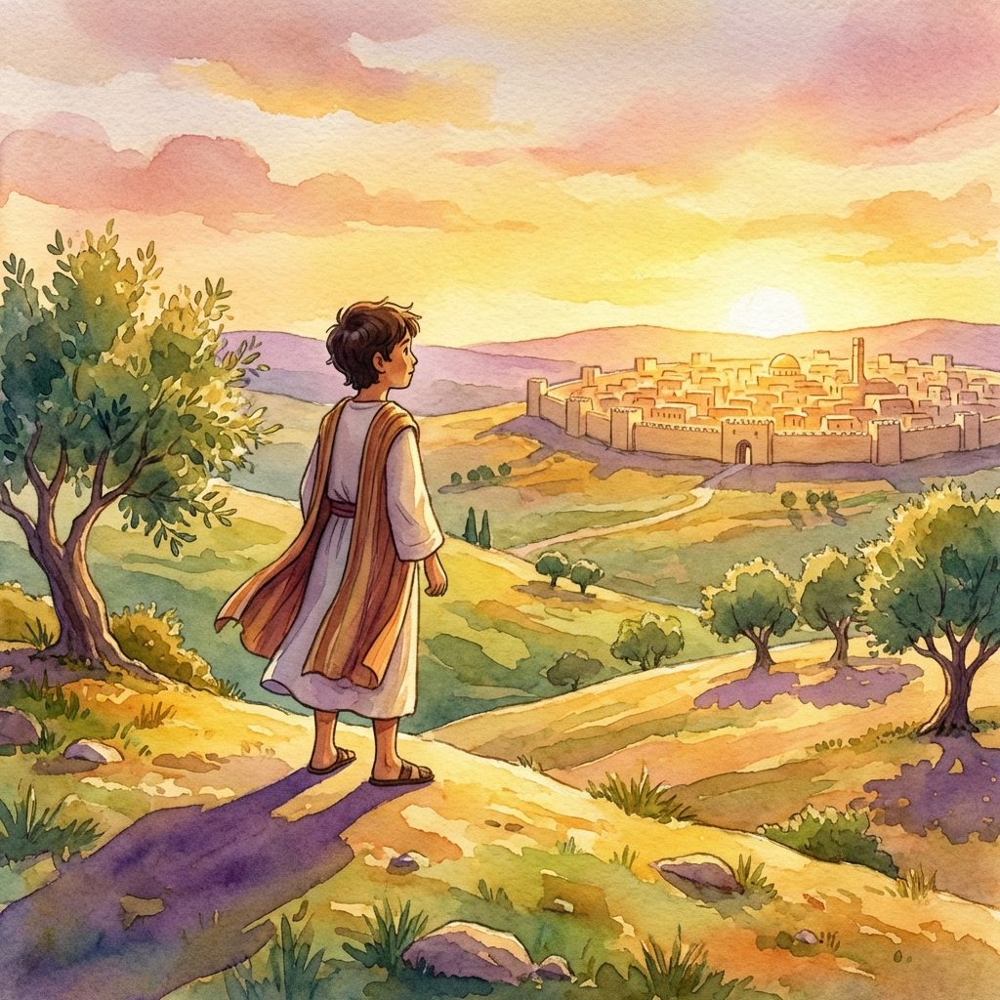

# 📖 Bible Quiz for Kids: Josiah & Jeremiah

[](https://kikuai.dev)
[](https://opensource.org/licenses/MIT)
[](https://nextjs.org)

An interactive Bible quiz for children about King Josiah and the prophet Jeremiah, with localized questions, watercolor-style illustrations, story transitions, a reward gallery, and audio.

**[Play the live quiz](https://kiku-jw.github.io/bible-quiz-kids/)**

---

## ✨ Features

- **🎨 Watercolor-style Illustrations**: PNG artwork accompanies the intro, questions, story transitions, and finale.
- **🌍 Multi-language Support**: Fully localized in **Ukrainian**, **Russian**, and **English**.
- **📜 Interactive Storytelling**: A blend of educational quiz mechanics and story-driven transitions.
- **🏆 Reward Gallery**: An interactive collection screen where kids can review and download the illustrations they've "unlocked" during the game.
- **🔊 Audio Feedback**: Background music and browser speech synthesis accompany the quiz.

## 📸 Sneak Peek

<div align="center">
  
  
</div>
<div align="center">
  
  
</div>

---

## 🛠️ Tech Stack

- **Core**: [Next.js 16](https://nextjs.org) (App Router), [React 19](https://react.dev)
- **Styling**: [Tailwind CSS 4](https://tailwindcss.com), [Framer Motion](https://www.framer.com/motion/) for animations.
- **Assets**: PNG illustrations stored with the static site.
- **Deployment**: [GitHub Pages](https://pages.github.com).

## 🚀 Getting Started

### Prerequisites

- Node.js 20.9 or later
- npm

### Installation

1. Clone the repository:
   ```bash
   git clone https://github.com/kiku-jw/bible-quiz-kids.git
   cd bible-quiz-kids
   ```

2. Install dependencies:
   ```bash
   npm install
   ```

3. Run the development server:
   ```bash
   npm run dev
   ```

Open [http://localhost:3000](http://localhost:3000) with your browser to see the result.

---

## 🏗️ Architecture

- `lib/quiz-data.ts`: Central hub for quiz content, localizations, and image mappings.
- `components/quiz/`: Heart of the application, containing `StoryScreen`, `QuestionCard`, and `CompletionScreen`.
- `public/illustrations/`: PNG assets used by the intro, questions, transitions, and completion screen.

## Runtime behavior

- The quiz runs entirely in the browser as a static export; it has no backend or account system.
- Progress is held in client memory, so reloading the page resets the current run.
- Question data, answer keys, feedback, and media assets are shipped to the browser and can be inspected; the quiz is not a secure testing environment.

---

<div align="center">
  <p>Built with ❤️ by <b>KikuAI</b></p>
  <p><a href="https://kikuai.dev">kikuai.dev</a></p>
</div>
